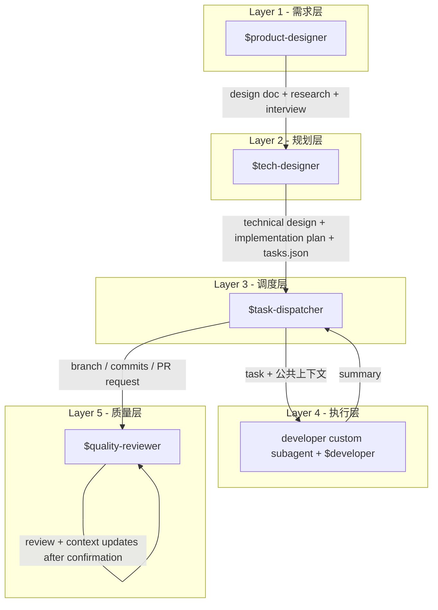
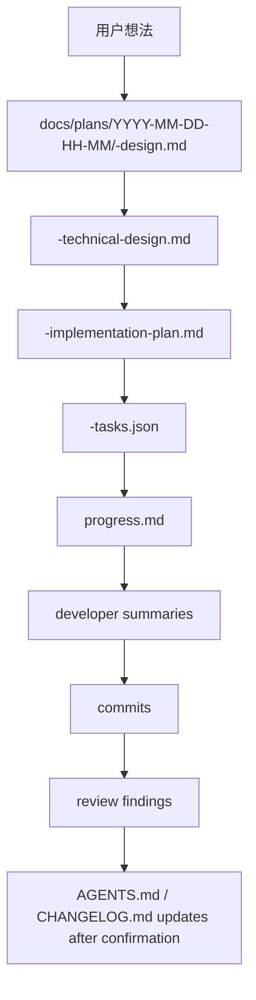

# Codex 开发流水线概览

本文档描述 codex-config 的 repo-local Codex 工作流：从用户想法到可运行代码，再到质量审查和项目上下文更新。

## 1. 架构概览



职责分离原则：

| 层级 | Codex 入口 | 回答的核心问题 |
|------|------------|----------------|
| 需求层 | `$product-designer` | 做什么、为什么做 |
| 规划层 | `$tech-designer` | 怎么做、如何拆任务 |
| 调度层 | `$task-dispatcher` | 什么时候做、按什么顺序做 |
| 执行层 | `developer` custom subagent + `$developer` | 写代码、写测试、返回 summary |
| 质量层 | `$quality-reviewer` | 质量达标吗、上下文是否需要更新 |

关键原则：technical plan 只定义验收标准（AC），不预写测试代码。TDD 是执行层的实现方法论，由 developer custom subagent 按 `$developer` 协议执行。

## 2. 入口与职责

| 入口 | 类型 | 主要输入 | 主要产出 | 关键文件 |
|------|------|----------|----------|----------|
| `$product-designer` | repo-local skill | 用户想法 / 需求描述 | `<topic>-design.md`、`research.md`、`<topic>-interview.md` | `.agents/skills/product-designer/SKILL.md` |
| `$tech-designer` | repo-local skill | design、research、interview | `<topic>-technical-design.md`、`<topic>-implementation-plan.md`、`<topic>-tasks.json` | `.agents/skills/tech-designer/SKILL.md` |
| `$task-dispatcher` | repo-local skill | implementation plan、tasks.json | `progress.md`、commits、最终执行报告 | `.agents/skills/task-dispatcher/SKILL.md` |
| `developer` + `$developer` | custom subagent + repo-local skill | 单个 task + 公共上下文 | 代码、测试、summary | `.codex/agents/developer.toml`、`.agents/skills/developer/SKILL.md` |
| `$quality-reviewer` | repo-local skill | working tree diff、PR 或分支对比 | review findings、质量结论、确认后的上下文更新 | `.agents/skills/quality-reviewer/SKILL.md` |

workflow 相关 repo-local skills 都是显式触发。每个 workflow skill 的 `agents/openai.yaml` 设置：

```yaml
policy:
  allow_implicit_invocation: false
```

例外：`$writing-clearly-and-concisely` 是写作辅助 skill，可按人类可读文本写作场景隐式触发。

## 3. Skills

| Skill | 用途 | 常见使用者 |
|-------|------|------------|
| `$codex-workflow-guide` | 回答本开发流水线、角色职责、产物流转、模板和安装方式 | 用户 |
| `$product-designer` | 将想法转成 design 文档 | 用户 |
| `$tech-designer` | 将 design 文档转成 technical design、implementation plan 和 tasks.json | 用户 |
| `$task-dispatcher` | 串行派发 tasks.json 中的任务给 developer custom subagent | 用户 |
| `$developer` | 单个 bounded coding task 的执行协议 | developer custom subagent |
| `$quality-reviewer` | 审查 diff 或 PR，必要时更新项目上下文 | 用户 |
| `$code-review` | 逐文件审查代码变更 | `$quality-reviewer` |
| `$project-summary` | 更新 AGENTS.md 和 CHANGELOG.md | `$quality-reviewer` |
| `$json-lint` | 校验 JSON 文件 | `$tech-designer` |
| `$test-driven-development` | RED-GREEN-REFACTOR 方法论 | `$developer` |
| `$systematic-debugging` | 系统化排查 bug / 测试失败 | `$developer` |
| `$writing-clearly-and-concisely` | 改善人类可读文档表达 | 需要写作编辑的 workflow |

## 4. 产物流转



### 4.1 product-designer -> tech-designer

`$product-designer` 默认在 `docs/plans/YYYY-MM-DD-HH-MM/` 下产出：

| 文件 | 内容 |
|------|------|
| `<topic>-design.md` | 产品设计文档 |
| `research.md` | 项目内或互联网研究结果 |
| `<topic>-interview.md` | 用户访谈记录 |

`$tech-designer` 读取这些输入，产出：

| 文件 | 消费者 |
|------|--------|
| `<topic>-technical-design.md` | 人类审阅 + 统一技术方向 |
| `<topic>-implementation-plan.md` | 人类审阅 + developer 公共上下文 |
| `<topic>-tasks.json` | `$task-dispatcher` 调度 |

### 4.2 task-dispatcher -> developer custom subagent

`$task-dispatcher` 按 tasks.json 数组顺序串行执行任务。每个任务派发一个新的 `developer` custom subagent，并按 `.agents/skills/task-dispatcher/references/developer-prompt-template.md` 构建 prompt。

该 prompt 第一行包含 `$developer`，用于显式加载 developer 执行协议 skill。

developer custom subagent 不 commit、不选择下一个 task、不修改全局 implementation plan。它只返回 `$developer` 定义的 summary。

### 4.3 quality-reviewer

`$quality-reviewer` 审查当前 working tree、PR 或分支对比。review 通过且用户确认后，才按 `$project-summary` 更新项目上下文；合并 PR 前也必须再次询问用户。

## 5. 安装与启动

推荐使用：

```bash
codex-config-init /path/to/target-repo
```

该命令会复制：

```text
.agents/skills/
.codex/agents/developer.toml
```

该命令不会创建、修改或合并目标 repo 的 `AGENTS.md`，也不会修改 `~/.codex/config.toml` 或注册 plugin marketplace。

安装后：

```bash
cd /path/to/target-repo
codex
```

然后显式输入：

```text
$codex-workflow-guide
```

或直接使用具体 workflow 入口，例如 `$product-designer`、`$tech-designer`、`$task-dispatcher`、`$quality-reviewer`。

## 6. 文件结构

```text
.agents/
  skills/
    codex-workflow-guide/
      SKILL.md
      agents/openai.yaml
      references/development-workflow.md
    product-designer/
    tech-designer/
    task-dispatcher/
    developer/
    quality-reviewer/
    code-review/
    project-summary/
    json-lint/
    test-driven-development/
    systematic-debugging/
    writing-clearly-and-concisely/
.codex/
  agents/
    developer.toml
bin/
  codex-config-init
  codex-design
  codex-tech-design
  codex-dispatch
  codex-review
```
